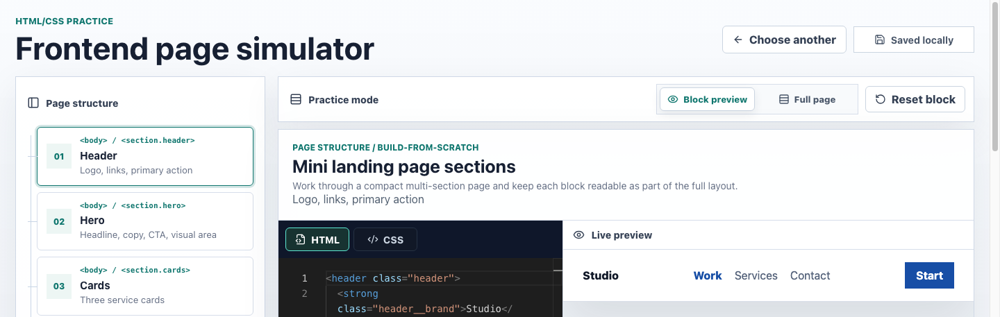

# Frontend Challenge Simulator

Личный HTML/CSS-тренажёр для короткой практики frontend-вёрстки. Это не готовая учебная база, а платформа: пользователь самостоятельно исследует источники, добавляет задачи как данные, пишет brief, reference notes и критерии, а затем проходит их для интервью-подготовки.

На первом экране нет заранее собранной страницы: пользователь выбирает challenge из каталога или запускает `Random challenge`, после чего открывается отдельная рабочая сцена с brief, Monaco Editor и live preview.

Проект намеренно не содержит теории, подсказок, проверки правильности, баллов, уровней или бэкенда.



## What it solves

- Быстрый старт frontend interview drills без лишнего интерфейсного шума.
- Практика разных типов задач: `build from scratch`, `fix layout`, `responsive`.
- Git-friendly workflow: каждая новая задача добавляется вручную в data module, без бэкенда и CMS.
- Task-specific drafts в `localStorage`, чтобы упражнения не конфликтовали между собой.
- Безопасный preview пользовательского HTML/CSS в sandboxed iframe без выполнения JavaScript.

## Features

- `Choose a challenge` empty state вместо автоматической мини-страницы.
- `Random challenge` и каталог стартовых задач.
- `Block preview` с HTML/CSS Monaco Editor и живым iframe preview.
- `Full page` и `Page map` показываются только для multi-section задач.
- `Reset block` возвращает текущий блок к starter-коду.
- `Saved locally` / `Saving...` отражают autosave без ручного save.
- Legacy drafts migration из старых ключей `localStorage` в task-specific storage.

## Sample tasks

В `src/data/tasks.ts` лежит минимальный технический seed/demo-набор, нужный для проверки flow:

- `Responsive cards row` — responsive cards drill с готовым desktop-стартом.
- `Header alignment` — flexbox header from scratch.
- `Fix a layout overlap` — намеренно сломанный promo layout.
- `Mini landing page sections` — multi-section sample для проверки `Page map`, `Full page` и legacy migration.

Это examples, а не попытка собрать полноценный курс. Новые реальные задачи предполагается добавлять по одной после самостоятельного исследования источников.

## Task data model

Новые задачи добавляются как данные в `src/data/tasks.ts`: `id`, `title`, `prompt`, `topic`, `difficulty`, `type`, `sections`, starter HTML/CSS и optional fields `sourceUrl`, `referenceSolution`, `assertions`. Подробности для будущего наполнения лежат в `src/data/README.md`.

Учебный HTML/CSS использует компонентный БЭМ: самостоятельные блоки (`header`, `hero`, `card`, `contact-form`, `footer`) и элементы вида `block__element`.

## Stack

- React
- Vite
- TypeScript
- CSS Modules
- Monaco Editor
- Lucide React
- iframe `sandbox`
- React state
- `localStorage`
- ESLint
- Prettier
- Vitest

## Local run

```bash
npm install
npm run dev
```

Vite starts on:

```text
http://127.0.0.1:5173/
```

## Checks

```bash
npm run typecheck
npm run lint
npm run format:check
npm run test
npm run build
```

`npm run build` runs TypeScript first and then creates the production Vite build.
