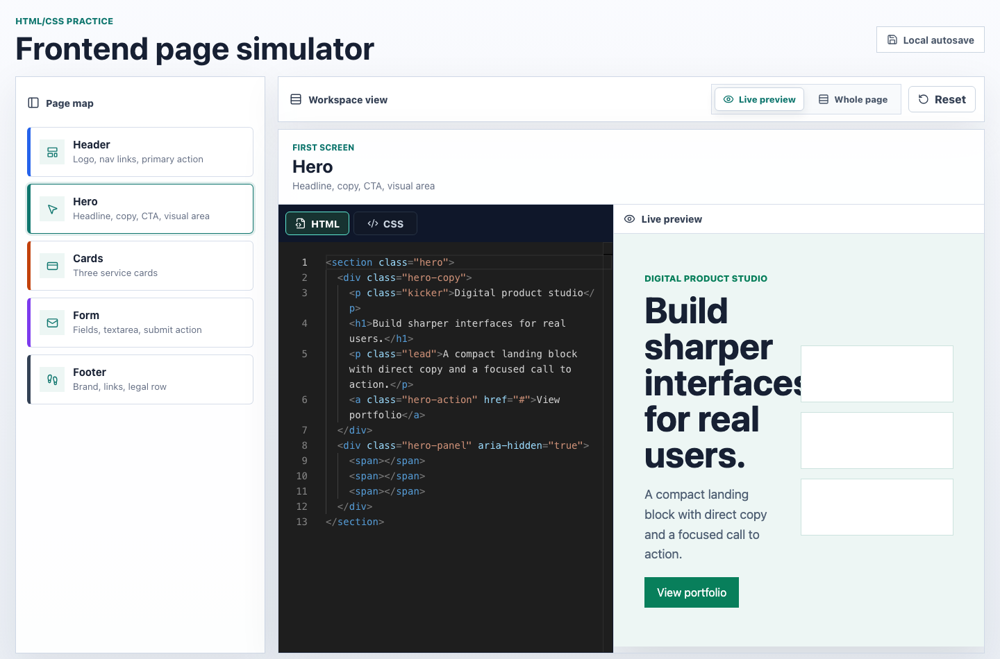

# Frontend Page Simulator

Интерактивный тренажёр для практики HTML и CSS на одной мини-странице. Проект сделан для чистой практики: без теории, подсказок, проверки правильности, баллов и бэкенда.

Пользователь выбирает блок страницы, пишет HTML/CSS и сразу видит результат в live preview.



## Что решает

Тренажёр помогает отрабатывать типовые фронтенд-задачи на небольших изолированных секциях страницы:

- шапка сайта;
- hero-блок;
- карточки;
- форма;
- футер.

Каждый блок можно редактировать отдельно, не отвлекаясь на оценку, автоматические подсказки или серверную часть.

## Возможности

- Карта страницы с выбором конкретного блока.
- Режим фокуса для выбранного упражнения.
- Monaco Editor для HTML и CSS.
- Мгновенный live preview выбранного блока.
- Sandboxed iframe для безопасного предпросмотра результата.
- Режим Whole page для просмотра всей собранной страницы.
- Автосохранение кода в localStorage.
- Reset для возврата выбранного упражнения к стартовому шаблону.

## Стек

- React
- Vite
- TypeScript
- CSS Modules
- Monaco Editor
- Lucide React
- iframe sandbox
- React state
- localStorage

## Локальный запуск

```bash
npm install
npm run dev
```

После запуска приложение будет доступно по адресу:

```text
http://127.0.0.1:5173/
```

## Сборка

```bash
npm run build
```

Команда выполняет проверку TypeScript и собирает production-версию через Vite.
